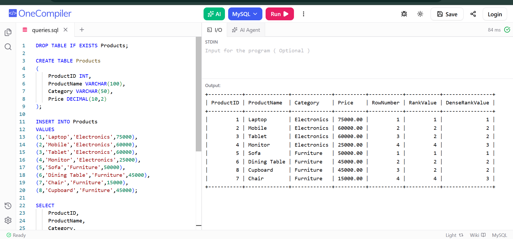

# Exercise 01 - Ranking and Window Functions

## Objective

To use SQL Server ranking functions to rank products within each category based on price.

## Concepts Used

- ROW_NUMBER()
- RANK()
- DENSE_RANK()
- OVER()
- PARTITION BY

## Description

A Products table is created with product details. Ranking functions are applied category-wise based on product price.

## Output

## Result

Successfully implemented ranking and window functions in SQL Server.
