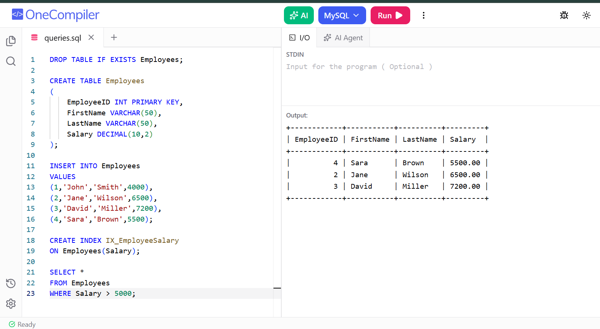

# Exercise 02 - Index Hands-On

## Objective

To create an index on the Salary column and retrieve employees whose salary is greater than 5000.

## Concepts Used

- CREATE INDEX
- SELECT
- WHERE clause
- Query optimization

## Output

## Result

Successfully created an index and executed a filtered query using the indexed column.
