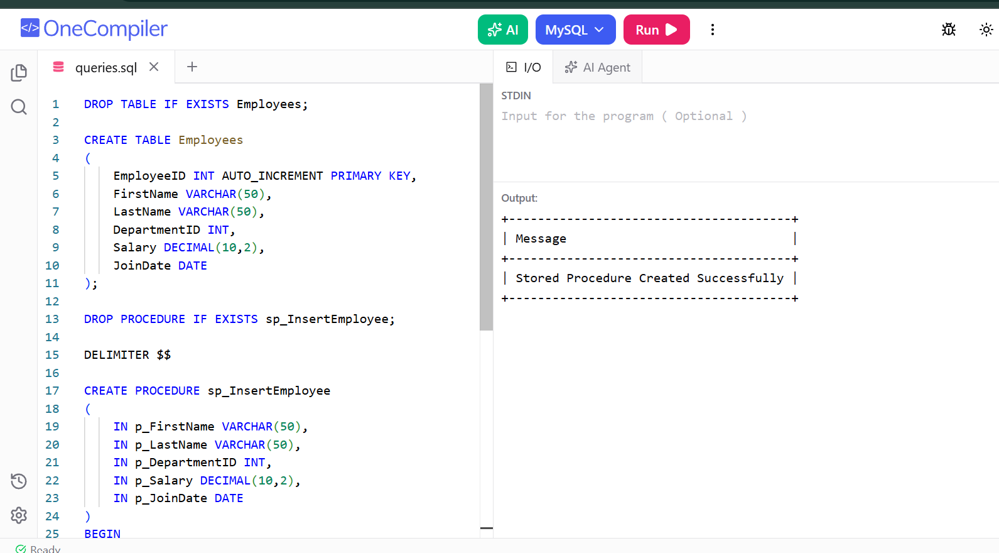

# Exercise 03 - Create Stored Procedure

## Objective

To create a stored procedure for inserting employee details.

## Concepts Used

- CREATE PROCEDURE
- Parameters
- INSERT statement

## Output

## Result

Successfully created a stored procedure in SQL Server.
