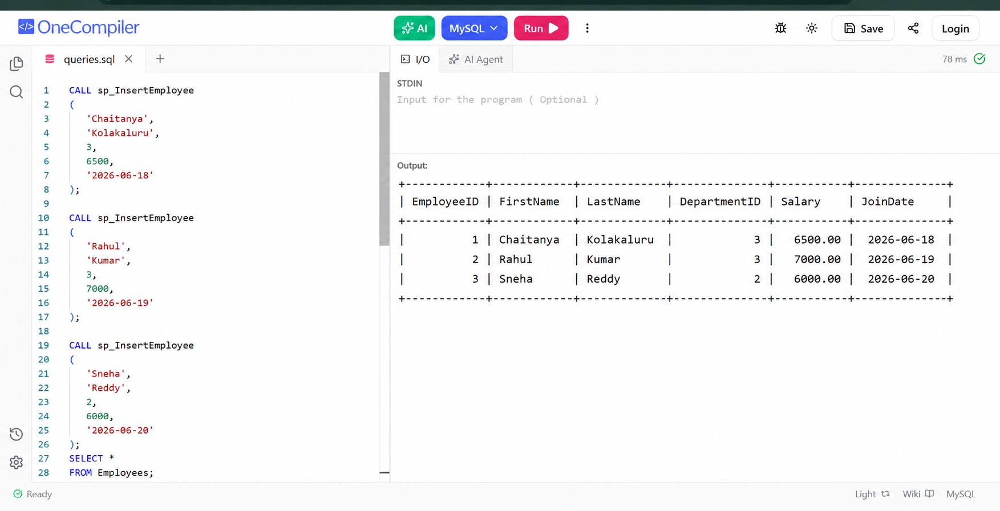

# Exercise 04 - Execute Stored Procedure

## Objective

To execute an existing stored procedure by passing employee details.

## Concepts Used

- EXEC
- Stored Procedures
- Parameter passing

## Output

## Result

Successfully executed the stored procedure and inserted employee records.
