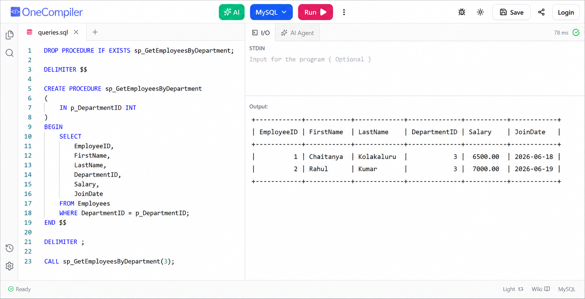

# Exercise 05 - Return Data From Stored Procedure

## Objective

To create and execute a stored procedure that returns employee data department-wise.

## Concepts Used

- Stored Procedures
- SELECT statement
- Parameters
- EXEC

## Output

## Result

Successfully returned data from a stored procedure.
