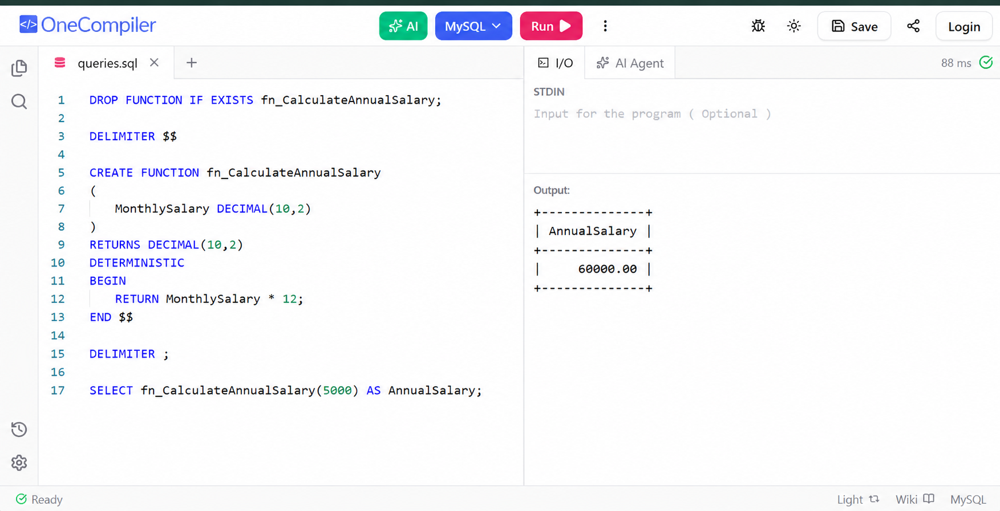

# Exercise 06 - Return Data From Scalar Function

## Objective

To create a scalar function that returns annual salary from monthly salary.

## Concepts Used

- User Defined Function
- Scalar Function
- RETURN statement

## Output

## Result

Successfully created and executed a scalar function in SQL Server.
